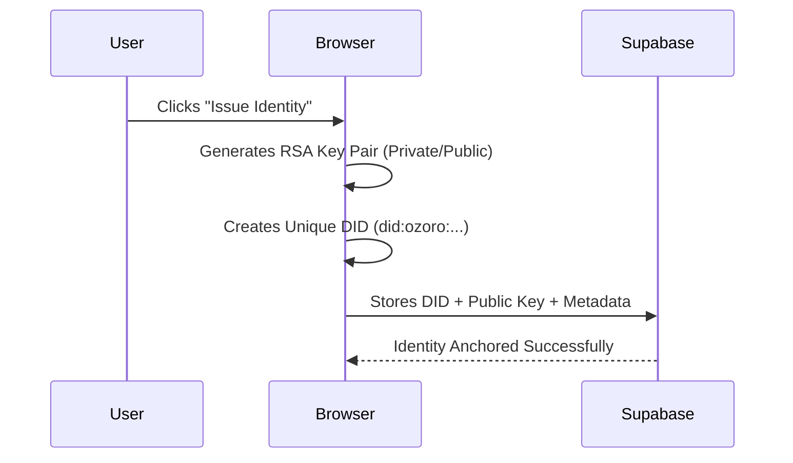

# 🧠 The OZORO Identity Ecosystem: The Complete Guide

Welcome to the future of the internet! This document explains how Secure-DIMS works—from the simple "Gold Star" analogy to the complex cryptographic code running behind the scenes.

---

## 🌟 1. The Quick Start Flow (Your First 5 Minutes)

To see the system in action, follow these exact steps:

1.  **Issue Identity**: On the home screen, enter your name/email. This creates your "Magic Keys" and a unique **DID** (Decentralized Identifier).
2.  **Add Attributes**: Go to **My Attributes**. Click "Add New Attribute" to add things like your School Name or Phone.
3.  **Get Verified (The Roleplay)**: 
    - Go to the **Request Queue** (under *Authority*). 
    - Act as the "Admin" and click **Approve** on your attributes.
    - Notice your **Trust Level** on the dashboard go from L1 ➡️ L2 ➡️ L3!
4.  **Share Proof**: 
    - Go to **Selective Disclosure**. 
    - Check ONLY the boxes you want to share. Click **Generate**.
    - Copy the long "Token" code that appears.
5.  **Test the Proof**: 
    - Go to the **Verifier Playground**. 
    - Paste your token and click **Verify**. 
    - The system will prove it's really you without ever seeing your profile!

---

## 📂 2. Section Breakdown: What is each room for?

We have split the dashboard into three logical areas based on the **SSI Trust Triangle**.

### 🏠 A. Digital Wallet (Holder) - *Your Private Space*
*This is where you live and manage your assets.*
-   **Dashboard**: Your "ID Card" summary. It shows your **DID** (your digital name address) and your **Trust Level** (assurance score).
-   **My Attributes**: Your digital filing cabinet. You can add, edit, or delete any information about yourself here.
-   **Selective Disclosure**: Your privacy tool. Use this to create a "temporary pass" (Token) that only contains specific information for a specific person.

### 🏛️ B. Trust Authority (Issuer) - *The Official Space*
*This space represents the organizations that vouch for you.*
-   **Request Queue**: Imagine this is an office at your University. In the real world, an official would look at your documents and click "Approve." Here, you can click it yourself to see how the system updates your trust score!

### � C. Public Space (Verifier) - *The External Space*
*This represents an "External App" (like a bank or a website).*
-   **Verifier Playground**: This section acts as a 3rd-party app. It doesn't have access to your private database. It only knows how to read the "Tokens" you give it. Paste a token here to see the cryptographic magic verify your identity.

---

## 🔑 3. The Science (How it works under the hood)

### The Identity Lifecycle
The system doesn't use standard usernames/passwords. It uses **Asymmetric Cryptography**.

### The Trust Scoring Engine
Your **Assurance Level (L1 to L4)** isn't just a label. It's a calculation based on verified attributes.

| Attribute | Points | Level | Verification Method |
| :--- | :--- | :--- | :--- |
| Email | +10 | **L1** | OTP (One-Time Password) |
| Phone | +15 | **L2** | SMS OTP |
| Institution | +25 | **L3** | Admin Approval (Issuer Portal) |
| Biometrics | +30 | **L4** | Face/Fingerprint Hash |

### Cryptographic Proof (The Challenge-Response)
When a verifier wants to check you, you don't give them your private key. 

1.  **Challenge:** The verifier gives you a random string: `x7j9...`
2.  **Signing:** Your browser signs it with your **Private Key** (Your secret stamp).
3.  **Verification:** The verifier checks the signature with your **Public Key** (The open lock). If they match, you are verified!

---

## �️ 4. Selective Disclosure (Novice Edition)

Imagine you want to buy a ticket for a scary movie. The ticket seller needs to know your **Age**, but they don't need to know your **Home Address**.

- **Normal ID Card:** You show it, and they see everything.
- **OZORO ID:** You pick **ONLY** the "Age" box. Our system makes a special temporary ticket that *only* proves your age. This is the ultimate privacy.

---

## � 5. Summary for a Kindergarten Genius:
1.  **Wallet**: Your backpack with your stickers.
2.  **Authority**: The teacher who puts a "Gold Star" on your stickers.
3.  **Verifier**: The librarian who checks if you have a "Gold Star" before letting you borrow a book.
4.  **Playground**: The place where you test your stickers to see if they are real!

**You are now a Digital Identity Master!** 🔐🚀
